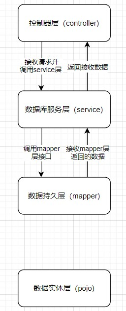
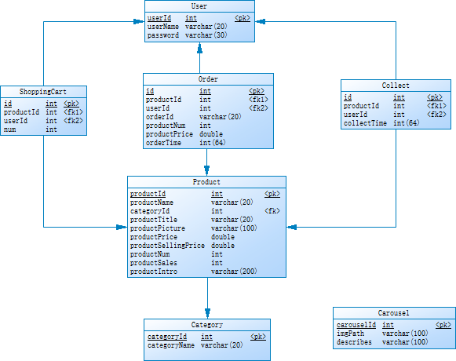

<center><h1>实训报告：项目二《升级版麦当劳网站》


## 一、项目背景

​		麦当劳是众人热爱的餐饮品牌，其美味食物带给了大家许多味蕾及心灵上的享受。它于1990年进入中国市场,始终坚持以高品质的食品、亲切友善的服务、清洁舒适的用餐环境和物超所值的用餐体验为每一位顾客提供最佳的用餐服务。浏览麦当劳中国官网，这种简约、活力的设计也深深地感染着我们。为了表达我们对麦当劳的热爱，我们决定构建一个升级版的麦当劳网站。为了弥补麦当劳中国官网无法在线点餐的缺点，我们将实现一个网上订餐功能；并且为了增加其趣味性，我们还将实现一个仅供娱乐的老虎机页面，解决用户“选择困难症”的问题。

## 二、需求介绍


## 三、关键技术简介

本项目前后端分离：
		前端基于`Vue2`+`Vue-router`+`Vuex`+`Axios`+`Element-ui` 实现；
		后端基于`SpringBoot`+`Rest`+`Lombok`+`MyBatis-Plus`+`MySQL`+`Redis`+`MD5` 实现。

## 前端


## 后端

#### Spring Boot

我们使用Spring Boot作为一种高效的javaweb后端框架。 Spring Boot 简化了 Spring 应用的初始搭建以及开发过程。该框架使用了特定的方式来进行配置，实现了IOC容器的自动装配，从而使开发人员不再需要定义样板化的配置。

#### Rest风格

我们使用Rest(Representational State Transfer)软件架构风格，对资源的操作url统一为/[资源名]，不同操作方式用HTTP请求方式动词来区分。降低了开发的复杂性，提高了系统的可伸缩性。

#### Lombok

Lombok项目是一个 java 库，它使用注解辅助生成类的方法，它可以自动插入到编辑器和构建工具中，增强 java 的性能。不需要再写 getter、setter 或equals 方法，只需要一个注解。

#### MyBatis-Plus

MyBatis 是一款的持久层框架，它支持定制化 SQL、存储过程以及高级映射。MyBatis 避免了几乎所有的 JDBC 代码和手动设置参数以及获取结果集。MyBatis 可以使用简单的 XML 或注解来配置和映射原生信息，将接口和 Java 的 POJOs映射成数据库中的记录。

MyBatis-Plus是一个基于 MyBatis 的增强工具，可以看作是对 MyBatis 的再一次封装，封装了JDBC，使得连接数据库的java程序与SQL语句分离。对于单表的 CRUD 操作，调用 MyBatis-Plus 所提供的 API 就能够轻松实现，此外还提供了各种查询方式、分页等行为。

#### MySQL

一种流行的关系数据库。我们将数据保存在不同的表中，而不是将所有数据放在一个大仓库内，这样就增加了速度并提高了灵活性。

#### Redis

一种内存中的数据结构存储系统，高性能的key-value数据库，支持存储的value类型很多，常用作sql数据库的缓存。在此项目用作cookie管理和身份验证。

#### MD5加密

MD5信息摘要算法，一种被广泛使用的密码散列函数，可以产生出一个128位（16字节）的散列值（hash value），用于确保信息传输完整一致。

## 四、系统设计

### 实现功能

* 登录、注册、判断用户名是否存在、获取用户信息
* 获取类别
* 获取产品照片id、根据id获取产品、根据展示页数获得产品。
* 获取购物车信息、添加商品到购物车、修改购物车商品数量、删除购物车商品
* 获取收藏信息、收藏商品、取消收藏商品、
* 获取首页轮播图
* 商品下单

### 项目结构

#### 前端采用 Vue2 常规项目结构

```c
McDonaldWeb
├─ public
   ├─ json // 模拟数据
   └─ images // 图片资源(大图片放public/imgs，小图片放src/assets)
├─ src
   ├─ api // 接口
      ├─ http.js // axios封装
      ├─ index.js // api接口统一出口
      ├─ base.js // api接口域名管理
      └─ mall.js // 商城模块api映射配置
   ├─ assets // css、iconfont、小图标
   ├─ components // 组件库
   ├─ config // 配置：环境变量
   ├─ mock // mock模拟数据
   ├─ newPages // 页面
   ├─ pages // 页面
   ├─ router // 路由
   ├─ storage // 本地数据存储：sessionStorage、localStorage
   ├─ store // vuex
   └─ util // 工具js库
├─ vue.config.js // 配置文件
├─ package.json // 项目核心配置记录，可查看当前安装依赖的版本号
├─ .gitignore //配置git可忽略的文件
```

#### 资源说明

##### public 静态资源

1. `public/font` 字体文件
2. `public/imgs` 图片文件
   * 图片资源(建议：大图片放public/imgs，小图片放src/assets)
   * 建议图片能够放后端或者云存储的尽量就别放前端，减少包体积和优化加载速度 。
   * 图片如果是复用的图片，不属于某个页面独有的图片，直接放此目录。
   * 图片如果属于某个功能模块独有的，需要建立一个和模块名称同名的文件夹，再存于文件夹下。如：`public/img/pay` 支付模块的图片。

##### assets 静态资源

`assets/scss` css文件

##### store vuex 缓存

我们采用分模块来管理各个vuex子模块，便于项目的维护和整合。

1. `index.js` 此文件是入口文件，方便整合和引入vuex模块
2. `modules/user.js`  此文件是用户信息相关vuex模块

##### 组件说明

- 组件命名规范

  * 组件名称：大驼峰，如：GoodsList.vue
  * 组件文件：组件名称/组件名称.vue，一个组件对应一个文件夹，该文件夹下可以有多个类型的文件（如：js、img、css等）。如：`goodsList/GoodsList.vue`

- 组件存放规范

  * 自定义公共复用组件存放为：`components/Com*/Com*.vue`这里存放自定义复用组件，方便开发和复用、共享。避免去uni-ui中直接修改，因为后面uni官方组件升级后会导致之前的自定义代码丢失。
  * 自定义非公共组件存放到：`当前页/组件文件`,如：首页的广告组件，`index/childComps/IndexAdv.vue`
    因为有的页面组件，自定义或者抽离的组件，也许其他页面根部就不会复用到，只是为了让主页面代码简洁和便于维护，那么这些组件，应该直接放到当前页下的`childComps`文件夹中，独立维护。

- 组件说明规范
  每个自定义组件在组件代码的`<script>`标签内的第一行备注：组件名称、组件描述、开发人员、组件参数等。

  ```vue
  <script>
     /*
     * LoadMore 加载更多
     * @description 用于列表中，做滚动加载使用，展示 loading 的各种状态
     * @author AuKeeWa
     * @property {String} status = [more|loading|noMore] loading 的状态
     * 	@value more loading 前
     * 	@value loading loading 中
     * 	@value noMore 没有更多了
     * @property {Number} iconSize 指定图标大小
     */
  
  </script>
  ```

##### 命名规范

* 文件夹名称：小驼峰
* js文件名称：小驼峰
* vue文件名称：大驼峰

#### 后端采用Spring MVC的经典分层架构

```c
 mcd
|--controller
   |--CarouselController
   |--CategoryController
   |--CollectController
   |--OrderController
   |--ProductController
   |--ProductPictureController
   |--ShoppingCartController
   |--UserController
|--exception // 异常类
   |--ExceptionEnum
   |--MDException
   |--XmException
   |--XmExceptionHandler
|--mapper
   |--CarouselMapper
   |--CategoryMapper
   |--CollectMapper
   |--OrderMapper
   |--ProductMapper
   |--ProductPictureMapper
   |--ShoppingCartMapper
   |--UserMapper
|--pojo
   |--Carousel //轮播图
   |--Category // 目录
   |--Collect //收藏
   |--Order //下单
   |--Product // 产品的相关信息
   |--ProductPicture // 产品图片
   |--ShoppingCart //购物车
   |--User // 用户账号密码
|--service
   |--CarouselService
   |--CategoryService
   |--CollectService
   |--OrderService
   |--ProductService
   |--ProductPictureService
   |--ShoppingCartService
   |--UserService
|--utils // 工具类
   |--BeanUtil
   |--CookieUtil
   |--IdWorker
   |--MD5Util
   |--ResultMessage
|--vo
   |--CartVo
   |--OrderVo
|--Application
```

* controller控制器层，负责前后端交互：从HTTP请求中获取信息，提取参数，并将其分发给不同的处理服务（service层），并向前端返回service层处理后的数据（JSON数据或者ModelAndView对象）。
* service业务层，存放业务逻辑处理，前接controller，后接mapper。包括接口声明、接口继承、接口实现。
* mapper数据层，数据库的接口。
* pojo，实体类，与数据库的表相对应。
* 其他，utils内定义了一系列用到的工具类，vo视图层在返回前端前对数据进行最后的适应性包装。



## 项目本地部署

### 前端

```xml
所需环境：Node.js + Vue + Vue-cli
运行流程：
1. 克隆项目
git clone https://github.com/AuKeeWa/McDonaldWeb.git

2. 安装项目依赖
cd vue-store
npm install

3. 开发项目：编译和热重载
npm run serve

4. 部署项目：编译和打包
npm run build
```

### 后端

```xml
所需环境：Java17 + SpringBoot
所需依赖：<?xml version="1.0" encoding="UTF-8"?>
<project xmlns="http://maven.apache.org/POM/4.0.0" xmlns:xsi="http://www.w3.org/2001/XMLSchema-instance"
         xsi:schemaLocation="http://maven.apache.org/POM/4.0.0 https://maven.apache.org/xsd/maven-4.0.0.xsd">
    <modelVersion>4.0.0</modelVersion>
    <parent>
        <groupId>org.springframework.boot</groupId>
        <artifactId>spring-boot-starter-parent</artifactId>
        <version>2.7.5</version>
        <relativePath/> <!-- lookup parent from repository -->
    </parent>
    <groupId>com.example</groupId>
    <artifactId>demo2</artifactId>
    <version>0.0.1-SNAPSHOT</version>
    <name>demo2</name>
    <description>Demo project for Spring Boot</description>
    <properties>
        <java.version>17</java.version>
    </properties>
    <dependencies>
        <dependency>
            <groupId>org.springframework.boot</groupId>
            <artifactId>spring-boot-starter-jdbc</artifactId>
        </dependency>
        <dependency>
            <groupId>org.springframework.boot</groupId>
            <artifactId>spring-boot-starter-thymeleaf</artifactId>
        </dependency>
        <dependency>
            <groupId>org.springframework.boot</groupId>
            <artifactId>spring-boot-starter-web</artifactId>
        </dependency>
        <dependency>
            <groupId>org.mybatis.spring.boot</groupId>
            <artifactId>mybatis-spring-boot-starter</artifactId>
            <version>2.2.2</version>
        </dependency>
        <dependency>
            <groupId>org.springframework.boot</groupId>
            <artifactId>spring-boot-starter-data-redis</artifactId>
        </dependency>
        <dependency>
            <groupId>org.projectlombok</groupId>
            <artifactId>lombok</artifactId>
        </dependency>
        <dependency>
            <groupId>tk.mybatis</groupId>
            <artifactId>mapper-spring-boot-starter</artifactId>
            <version>2.0.2</version>
        </dependency>
        <dependency>
            <groupId>com.mysql</groupId>
            <artifactId>mysql-connector-j</artifactId>
        </dependency>
        <dependency>
            <groupId>org.springframework.boot</groupId>
            <artifactId>spring-boot-starter-test</artifactId>
            <scope>test</scope>
        </dependency>
        <dependency>
            <groupId>org.apache.commons</groupId>
            <artifactId>commons-lang3</artifactId>
            <version>3.9</version>
        </dependency>
        <dependency>
            <groupId>org.slf4j</groupId>
            <artifactId>slf4j-api</artifactId>
            <version>1.7.26</version>
            <scope>compile</scope>
        </dependency>
    </dependencies>

    <build>
        <plugins>
            <plugin>
                <groupId>org.springframework.boot</groupId>
                <artifactId>spring-boot-maven-plugin</artifactId>
            </plugin>
        </plugins>
    </build>
</project>
运行流程：
运行 Application.java 文件
```

## 五、功能模块介绍

### 前端


#### 核心代码展示


### 后端


#### 核心代码展示

##### 登录注册

下面方法实现了用户的登录注册功能。

```java
public User login(User user) {
        user.setPassword(MD5Util.MD5Encode(user.getPassword() + "", "UTF-8"));
        User one = userMapper.selectOne(user);
        if (one == null) {
            throw new MDException(ExceptionEnum.GET_USER_NOT_FOUND);
        }
        return one;
    }

    public void register(User user) {
        User one = new User();
        one.setUsername(user.getUsername());
        // 先去看看用户名是否重复
        if (userMapper.selectCount(one) == 1) {
            // 用户名已存在
            throw new MDException(ExceptionEnum.SAVE_USER_REUSE);
        }
        // 使用md5对密码进行加密
        user.setPassword(MD5Util.MD5Encode(user.getPassword() + "", "UTF-8"));
        // 存入数据库
        try {
            userMapper.insert(user);
        } catch (Exception e) {
            e.printStackTrace();
            throw new MDException(ExceptionEnum.SAVE_USER_ERROR);
        }
    }
```

##### 商品收藏

controller.CollectController.java中实现了获取收藏信息、收藏商品、取消收藏商品的功能。

```java
@Service
public class CollectService {

    @Autowired
    private CollectMapper collectMapper;

    @Transactional
    public void addCollect(String userId, String productId) {
        Collect collect = new Collect();
        collect.setUserId(Integer.parseInt(userId));
        collect.setProductId(Integer.parseInt(productId));
        // 先看看是否数据库中已存在
        Collect one = collectMapper.selectOne(collect);
        if (one != null) {
            throw new XmException(ExceptionEnum.SAVE_COLLECT_REUSE);
        }
        // 不存在，添加收藏
        collect.setCollectTime(new Date().getTime());
        int count = collectMapper.insert(collect);
        if (count != 1) {
            throw new XmException(ExceptionEnum.SAVE_COLLECT_ERROR);
        }
    }

    public List<Product> getCollect(String userId) {
        List<Product> list = null;
        try {
            list = collectMapper.getCollect(userId);
            if (ArrayUtils.isEmpty(list.toArray())) {
                throw new XmException(ExceptionEnum.GET_COLLECT_NOT_FOUND);
            }
        } catch (XmException e) {
            e.printStackTrace();
            throw new XmException(ExceptionEnum.GET_COLLECT_ERROR);
        }
        return list;
    }

    public void deleteCollect(String userId, String productId) {
        Collect collect = new Collect();
        collect.setUserId(Integer.parseInt(userId));
        collect.setProductId(Integer.parseInt(productId));
        try {
            int count = collectMapper.delete(collect);
            if (count != 1) {
                throw new XmException(ExceptionEnum.DELETE_COLLECT_ERROR);
            }
        } catch (XmException e) {
            e.printStackTrace();
            throw new XmException(ExceptionEnum.DELETE_COLLECT_ERROR);
        }
    }
}
```

##### 商品下单

controller.OrderController.java中实现了商品下单的功能。

```java
@Service
public class OrderService {

    @Autowired
    private IdWorker idWorker;
    @Autowired
    private RedisTemplate redisTemplate;
    @Autowired
    private OrderMapper orderMapper;
    @Autowired
    private ShoppingCartMapper cartMapper;
    @Autowired
    private ProductMapper productMapper;


    @Transactional
    public void addOrder(List<CartVo> cartVoList, Integer userId) {
        // 先添加订单
        String orderId = idWorker.nextId() + ""; // 订单id
        long time = new Date().getTime(); // 订单生成时间
        for (CartVo cartVo : cartVoList) {
            Order order = new Order();
            order.setOrderId(orderId);
            order.setOrderTime(time);
            order.setProductNum(cartVo.getNum());
            order.setProductId(cartVo.getProductId());
            order.setProductPrice(cartVo.getPrice());
            order.setUserId(userId);
            try {
                orderMapper.insert(order);
            } catch (Exception e) {
                e.printStackTrace();
                throw new XmException(ExceptionEnum.ADD_ORDER_ERROR);
            }
            // 减去商品库存,记录卖出商品数量
            Product product = productMapper.selectByPrimaryKey(cartVo.getProductId());
            product.setProductNum(product.getProductNum() - cartVo.getNum());
            product.setProductSales(product.getProductSales() + cartVo.getNum());
            productMapper.updateByPrimaryKey(product);
        }
        // 删除购物车
        ShoppingCart cart = new ShoppingCart();
        cart.setUserId(userId);
        try {
            int count = cartMapper.delete(cart);
            if (count == 0) {
                throw new XmException(ExceptionEnum.ADD_ORDER_ERROR);
            }
        } catch (Exception e) {
            e.printStackTrace();
            throw new XmException(ExceptionEnum.ADD_ORDER_ERROR);
        }

    }

    public List<List<OrderVo>> getOrder(Integer userId) {
        List<OrderVo> list = null;
        ArrayList<List<OrderVo>> ret = new ArrayList<>();
        try {
            list = orderMapper.getOrderVoByUserId(userId);
            if (ArrayUtils.isEmpty(list.toArray())) {
                throw new XmException(ExceptionEnum.GET_ORDER_NOT_FOUND);
            }
            // 将同一个订单放在一组
            Map<String, List<OrderVo>> collect = list.stream().collect(Collectors.groupingBy(Order::getOrderId));
            Collection<List<OrderVo>> values = collect.values();
            ret.addAll(values);
        } catch (XmException e) {
            e.printStackTrace();
            throw new XmException(ExceptionEnum.GET_ORDER_ERROR);
        }
        return ret;
    }

}
```

##### 订单ID自增长

utils.IdWorker.java中实现了分布式自增长的订单ID。

原理结构如下，分别用一个0表示一位，用-分割开部分的作用：

1||0---0000000000 0000000000 0000000000 0000000000 0 --- 00000 ---00000 ---000000000000

在上面的字符串中，第一位为未使用（实际上也可作为long的符号位），接下来的41位为毫秒级时间，然后5位datacenter标识位，5位机器ID（并不算标识符，实际是为线程标识），然后12位该毫秒内的当前毫秒内的计数，加起来刚好64位，为一个Long型。

这样的好处是，整体上按照时间自增排序，并且整个分布式系统内不会产生ID碰撞（由datacenter和机器ID作区分），并且效率较高，经测试，snowflake每秒能够产生26万ID左右，完全满足需要。

```java
public class IdWorker {
    // 时间起始标记点，作为基准，一般取系统的最近时间（一旦确定不能变动）
    private final static long twepoch = 1288834974657L;
    // 机器标识位数
    private final static long workerIdBits = 5L;
    // 数据中心标识位数
    private final static long datacenterIdBits = 5L;
    // 机器ID最大值
    private final static long maxWorkerId = -1L ^ (-1L << workerIdBits);
    // 数据中心ID最大值
    private final static long maxDatacenterId = -1L ^ (-1L << datacenterIdBits);
    // 毫秒内自增位
    private final static long sequenceBits = 12L;
    // 机器ID偏左移12位
    private final static long workerIdShift = sequenceBits;
    // 数据中心ID左移17位
    private final static long datacenterIdShift = sequenceBits + workerIdBits;
    // 时间毫秒左移22位
    private final static long timestampLeftShift = sequenceBits + workerIdBits + datacenterIdBits;

    private final static long sequenceMask = -1L ^ (-1L << sequenceBits);
    /* 上次生产id时间戳 */
    private static long lastTimestamp = -1L;
    // 0，并发控制
    private long sequence = 0L;

    private final long workerId;
    // 数据标识id部分
    private final long datacenterId;

    public IdWorker(){
        this.datacenterId = getDatacenterId(maxDatacenterId);
        this.workerId = getMaxWorkerId(datacenterId, maxWorkerId);
    }
    /**
     * @param workerId
     *            工作机器ID
     * @param datacenterId
     *            序列号
     */
    public IdWorker(long workerId, long datacenterId) {
        if (workerId > maxWorkerId || workerId < 0) {
            throw new IllegalArgumentException(String.format("worker Id can't be greater than %d or less than 0", maxWorkerId));
        }
        if (datacenterId > maxDatacenterId || datacenterId < 0) {
            throw new IllegalArgumentException(String.format("datacenter Id can't be greater than %d or less than 0", maxDatacenterId));
        }
        this.workerId = workerId;
        this.datacenterId = datacenterId;
    }
    /**
     * 获取下一个ID
     *
     * @return
     */
    public synchronized long nextId() {
        long timestamp = timeGen();
        if (timestamp < lastTimestamp) {
            throw new RuntimeException(String.format("Clock moved backwards.  Refusing to generate id for %d milliseconds", lastTimestamp - timestamp));
        }

        if (lastTimestamp == timestamp) {
            // 当前毫秒内，则+1
            sequence = (sequence + 1) & sequenceMask;
            if (sequence == 0) {
                // 当前毫秒内计数满了，则等待下一秒
                timestamp = tilNextMillis(lastTimestamp);
            }
        } else {
            sequence = 0L;
        }
        lastTimestamp = timestamp;
        // ID偏移组合生成最终的ID，并返回ID
        long nextId = ((timestamp - twepoch) << timestampLeftShift)
                | (datacenterId << datacenterIdShift)
                | (workerId << workerIdShift) | sequence;

        return nextId;
    }

    private long tilNextMillis(final long lastTimestamp) {
        long timestamp = this.timeGen();
        while (timestamp <= lastTimestamp) {
            timestamp = this.timeGen();
        }
        return timestamp;
    }

    private long timeGen() {
        return System.currentTimeMillis();
    }

    /**
     * <p>
     * 获取 maxWorkerId
     * </p>
     */
    protected static long getMaxWorkerId(long datacenterId, long maxWorkerId) {
        StringBuffer mpid = new StringBuffer();
        mpid.append(datacenterId);
        String name = ManagementFactory.getRuntimeMXBean().getName();
        if (!name.isEmpty()) {
         /*
          * GET jvmPid
          */
            mpid.append(name.split("@")[0]);
        }
      /*
       * MAC + PID 的 hashcode 获取16个低位
       */
        return (mpid.toString().hashCode() & 0xffff) % (maxWorkerId + 1);
    }

    /**
     * <p>
     * 数据标识id部分
     * </p>
     */
    protected static long getDatacenterId(long maxDatacenterId) {
        long id = 0L;
        try {
            InetAddress ip = InetAddress.getLocalHost();
            NetworkInterface network = NetworkInterface.getByInetAddress(ip);
            if (network == null) {
                id = 1L;
            } else {
                byte[] mac = network.getHardwareAddress();
                id = ((0x000000FF & (long) mac[mac.length - 1])
                        | (0x0000FF00 & (((long) mac[mac.length - 2]) << 8))) >> 6;
                id = id % (maxDatacenterId + 1);
            }
        } catch (Exception e) {
            System.out.println(" getDatacenterId: " + e.getMessage());
        }
        return id;
    }
}
```

##### MD5加密

utils.MD5Util.java中实现了MD5加密算法。

```java
public class MD5Util {
    private static String byteArrayToHexString(byte b[]) {
        StringBuffer resultSb = new StringBuffer();
        for (int i = 0; i < b.length; i++)
            resultSb.append(byteToHexString(b[i]));

        return resultSb.toString();
    }

    private static String byteToHexString(byte b) {
        int n = b;
        if (n < 0)
            n += 256;
        int d1 = n / 16;
        int d2 = n % 16;
        return hexDigits[d1] + hexDigits[d2];
    }

    public static String MD5Encode(String origin, String charsetname) {
        String resultString = null;
        try {
            resultString = new String(origin);
            MessageDigest md = MessageDigest.getInstance("MD5");
            if (charsetname == null || "".equals(charsetname))
                resultString = byteArrayToHexString(md.digest(resultString
                        .getBytes()));
            else
                resultString = byteArrayToHexString(md.digest(resultString
                        .getBytes(charsetname)));
        } catch (Exception exception) {
        }
        return resultString;
    }

    private static final String hexDigits[] = {"0", "1", "2", "3", "4", "5",
            "6", "7", "8", "9", "a", "b", "c", "d", "e", "f"};


    public static void main(String[] args) {
        MD5Util md5Util = new MD5Util();
        String s = md5Util.MD5Encode("123", "UTF-8");
        System.out.println(s);//202cb962ac59075b964b07152d234b70
    }
}
```

### 数据库设计

#### 数据库物理结构关联图



#### 数据表结构详细设计

用户（User）

| 序号 | 列名     | 数据类型 | 长度 | 键值 | 允许空 | 说明         |
| ---- | -------- | -------- | ---- | ---- | ------ | ------------ |
| 1    | userId   | int      |      | 主键 | 否     | 用户ID，自增 |
| 2    | userName | varchar  | 20   |      | 否     | 用户名       |
| 3    | password | varchar  | 30   |      | 否     | 密码         |

产品（Product）

| 序号 | 列名                | 数据类型 | 长度 | 键值 | 允许空 | 说明         |
| ---- | ------------------- | -------- | ---- | ---- | ------ | ------------ |
| 1    | productId           | int      |      | 主键 | 否     | 产品ID，自增 |
| 2    | productName         | varchar  | 20   |      | 否     | 产品名称     |
| 3    | categoryId          | int      |      | 外键 | 是     | 类型ID       |
| 4    | productTitle        | varchar  | 20   |      | 是     | 产品标题     |
| 5    | productPicture      | varchar  | 100  |      | 是     | 产品图片路径 |
| 6    | productPrice        | double   |      |      | 否     | 产品价格     |
| 7    | productSellingPrice | double   |      |      | 否     | 产品售价     |
| 8    | productNum          | int      |      |      | 否     | 产品数量     |
| 9    | productSales        | int      |      |      | 否     | 产品销量     |
| 10   | productIntro        | varchar  | 200  |      | 是     | 产品简介     |

产品类型（Category）

| 序号 | 列名         | 数据类型 | 长度 | 键值 | 允许空 | 说明     |
| ---- | ------------ | -------- | ---- | ---- | ------ | -------- |
| 1    | categoryId   | int      |      | 主键 | 否     | 类型ID   |
| 2    | categoryName | varchar  | 20   |      | 否     | 类型名称 |

购物车（ShoppingCart）

| 序号 | 列名      | 数据类型 | 长度 | 键值 | 允许空 | 说明     |
| ---- | --------- | -------- | ---- | ---- | ------ | -------- |
| 1    | id        | int      |      | 主键 | 否     | 购物车ID |
| 2    | productId | int      |      | 外键 | 否     | 产品ID   |
| 3    | userId    | int      |      | 外键 | 否     | 用户ID   |
| 4    | num       | int      |      |      | 否     | 购买数量 |

收藏（Collect）

| 序号 | 列名        | 数据类型 | 长度 | 键值 | 允许空 | 说明     |
| ---- | ----------- | -------- | ---- | ---- | ------ | -------- |
| 1    | id          | int      |      | 主键 | 否     | 收藏ID   |
| 2    | productId   | int      |      | 外键 | 否     | 产品ID   |
| 3    | userId      | int      |      | 外键 | 否     | 用户ID   |
| 4    | collectTime | int      | 64   |      | 否     | 收藏时间 |

订单（Order）

| 序号 | 列名         | 数据类型 | 长度 | 键值 | 允许空 | 说明     |
| ---- | ------------ | -------- | ---- | ---- | ------ | -------- |
| 1    | id           | int      |      | 主键 | 否     | 订单ID   |
| 2    | productId    | int      |      | 外键 | 否     | 产品ID   |
| 3    | userId       | int      |      | 外键 | 否     | 用户ID   |
| 4    | orderId      | varchar  | 20   |      | 否     | 订单号   |
| 5    | productNum   | int      |      |      | 否     | 购买数量 |
| 6    | productPrice | double   |      |      | 否     | 产品单价 |
| 7    | orderTime    | int      | 64   |      | 否     | 订餐时间 |

轮播图（Carousel）

| 序号 | 列名       | 数据类型 | 长度 | 键值 | 允许空 | 说明         |
| ---- | ---------- | -------- | ---- | ---- | ------ | ------------ |
| 1    | carouselId | int      |      | 主键 | 否     | 轮播ID       |
| 2    | imgPath    | varchar  | 100  |      | 是     | 图片路径     |
| 3    | describes  | varchar  | 100  |      | 是     | 推广内容描述 |


## 六、成员分工

#### 前端成员

欧骐华：

李颖欣：

#### 后端成员

叶晓：实现用户、产品等部分的接口、实现部分业务逻辑、撰写部分项目报告。

张境宏：实现购物车、下单等部分的接口、实现部分业务逻辑、撰写部分项目报告。

孔浩楷：完成数据库设计，撰写部分项目报告。